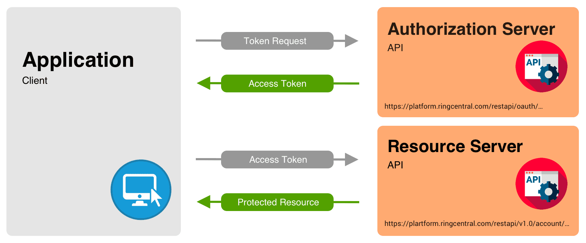

# Status codes

1. **200 OK**:

   - Description: The request was successful, and the server returned the requested data.
   - Use cases: Use this status code when the request has been successfully processed.

2. **204 No Content**:

   - Description: The request was successful, but there is no content to return.
   - Use cases: Use this when the request is successful, but no content needs to be returned.

3. **201 Created**:

   - Description: The request has been fulfilled, and a new resource has been created.
   - Use cases: Use this when a new resource is created as a result of the request.

4. **202 Accepted**:

   - Description: The request has been accepted for processing, but the processing has not been completed.
   - Use cases: Use this when the request will be processed asynchronously.

5. **400 Bad Request**:

   - Description: The server cannot process the request due to a client error.
   - Use cases: Use this when the request syntax is invalid or the request message contains invalid parameters.

6. **422 Unprocessable Entity**:

   - Description: The server understands the content type of the request entity but cannot process the contained instructions.
   - Use cases: Use this when the request is well-formed but contains semantic errors.

7. **401 Unauthorized**:

   - Description: The request requires user authentication.
   - Use cases: Use this when the request lacks proper authentication credentials.

8. **403 Forbidden**:

   - Description: The server understood the request, but refuses to authorize it.
   - Use cases: Use this when the server recognizes the client's credentials, but the client does not have permissions to access the requested resource.

9. **404 Not Found**:

   - Description: The server cannot find the requested resource.
   - Use cases: Use this when the requested resource is not available.

10. **500 Internal Server Error**:

    - Description: A generic error message indicating that the server encountered an unexpected condition that prevented it from fulfilling the request.
    - Use cases: Use this when the server encounters an error that prevents it from fulfilling the request.

11. **429 Too Many Requests**:
    - Description: The user has sent too many requests in a given amount of time.
    - Use cases: Use this when the client has exceeded a rate limit.

---

## Simple Guid With CRUD (Create, Read, Update, Delete) for books API

#### Messages and status codes

- **400 Bad Request**: Invalid request syntax or parameters.
- **401 Unauthorized**: Authentication failure.
- **403 Forbidden**: User does not have permission to perform the operation.
- **404 Not Found**: Resource not found.
- **409 Conflict**: Conflict while creating or updating a resource.
- **500 Internal Server Error**: Server encountered an unexpected condition.

#### CRUD Operations

#### 1. Create (POST /books)

- **Success (201 Created)**: Book created successfully.
- **Error (400 Bad Request)**: Invalid request body | Invalid data
- **Error (401 Unauthorized)**: Authentication failed.
- **Error (403 Forbidden)**: User does not have permission to create a book **(Optional)**.
- **Error (409 Conflict)**: Book with the same title already exists **(Optional)**.

#### 2. Read (GET /books/{id})

- **Success (200 OK)**: successfully get book.
- **Error (401 Unauthorized)**: Authentication failed.
- **Error (403 Forbidden)**: User does not have permission to view the book.
- **Error (404 Not Found)**: Book not found.

#### 3. Update (PUT /books/{id})

- **Success (200 OK)**: Book updated successfully.
- **Error (400 Bad Request)**: Invalid request body.
- **Error (401 Unauthorized)**: Authentication failed.
- **Error (403 Forbidden)**: User does not have permission to update the book.
- **Error (404 Not Found)**: Book not found.
- **Error (500 Internal Server Error)**: Server encountered an unexpected condition.

#### 4. Delete (DELETE /books/{id})

- **Success (204 No Content)**: Book deleted successfully.
- **Error (401 Unauthorized)**: Authentication failed.
- **Error (403 Forbidden)**: User does not have permission to delete the book.
- **Error (404 Not Found)**: Book not found.
- **Error (500 Internal Server Error)**: Server encountered an unexpected condition.

## Example For Authentication Endpoints

1. User Sign-Up (POST /signup)

   Success (201 Created): User created successfully.
   Error (400 Bad Request): Invalid request body.
   Error (409 Conflict): User already exists with the provided email.
   Error (500 Internal Server Error): Server encountered an unexpected condition.

2. User Login (POST /login)

   Success (200 OK): User logged in successfully. Returns JWT token.
   Error (400 Bad Request): Invalid credentials.
   Error (500 Internal Server Error): Server encountered an unexpected condition.

### Authentication Flow

User can create a new `User` this will generate a `JWT-T`, also when user `Login` can generate it also.
and from client `JWT-T` will send in berar header in every request

1. User provides (`username` and `password`) to the `login` endpoint | Can `sign-up` also
2. Server verifies the credentials and generates a JWT token.
3. User includes the JWT token in the Authorization header for subsequent requests.
4. If the JWT token expires, user must login in again
